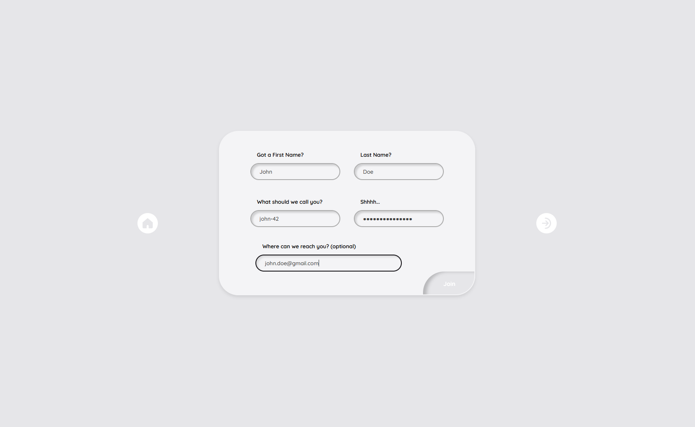
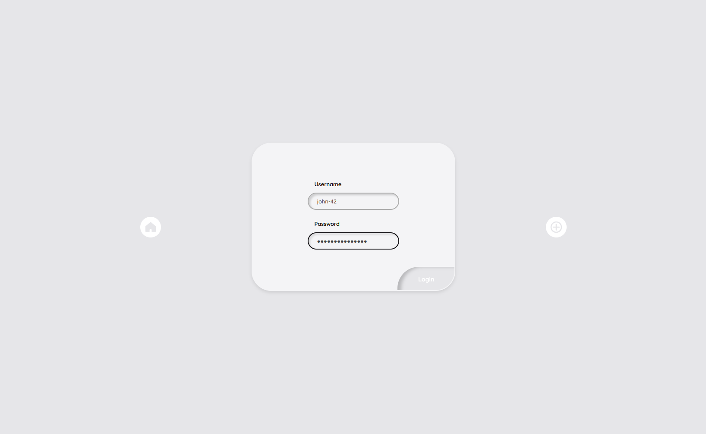
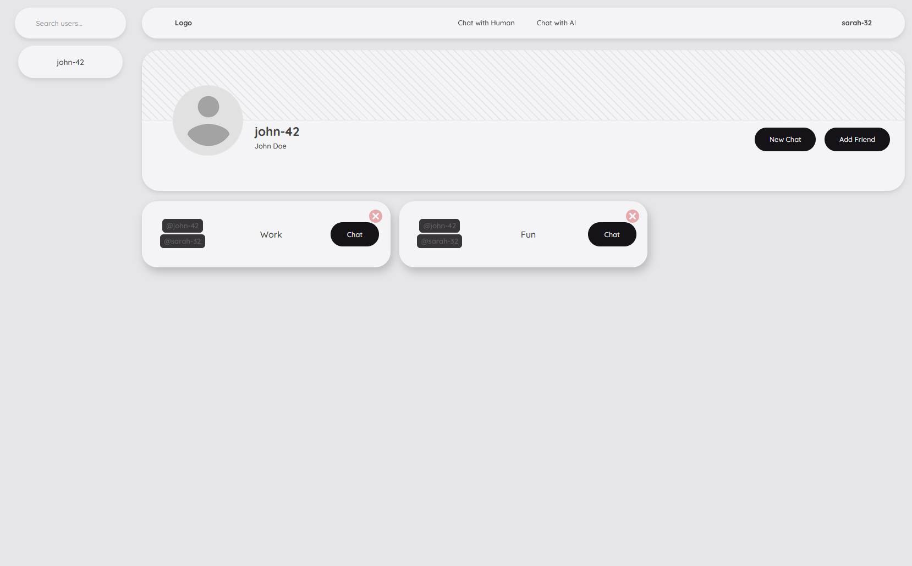
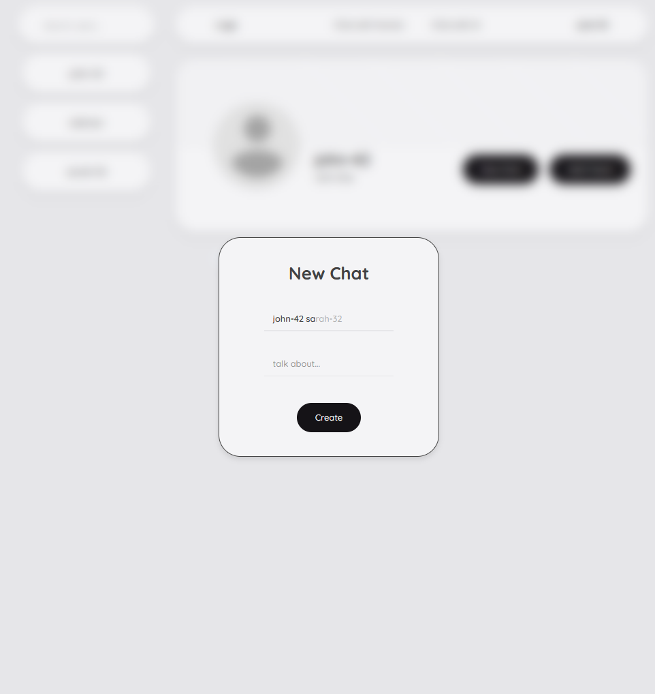
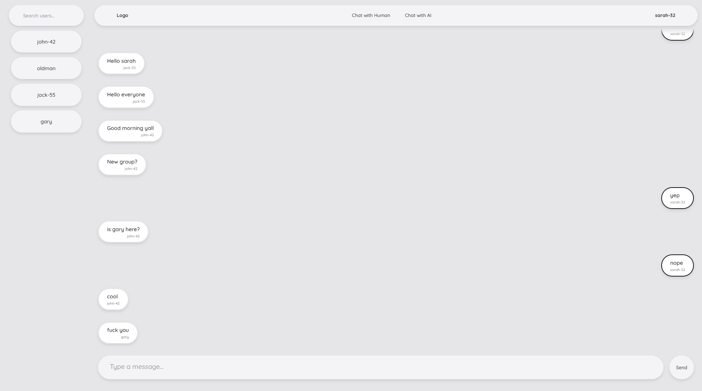

# CryptConnect 💬

A modern, real-time chatting application built with React and Django. Connect with friends, create group chats, and enjoy seamless communication with instant messaging powered by WebSockets.

## ✨ Features

- **Real-time Messaging**: Instant message delivery using WebSocket connections
- **User Authentication**: Secure login and registration system with JWT tokens
- **Chat Management**: Create, join, and manage multiple chat rooms
- **Modern UI**: Clean and responsive interface built with React
- **Cross-platform**: Works on desktop and mobile browsers
- **Docker Support**: Easy deployment with Docker containers

## � Screenshots

<div align="center">

### Login & Authentication




### User Dashboard


### Chat Management


### Chat Interface


</div>

## �🚀 Quick Start

### Prerequisites

- Docker Desktop
- Git

### Development Setup

1. **Clone the repository**
   ```bash
   git clone <your-repo-url>
   cd crypt-connect
   ```

2. **Start the development environment**
   ```bash
   docker-compose -f docker-compose.dev.yml up --build
   ```

3. **Access the application**
   - Frontend: http://localhost:3000
   - Backend API: http://localhost:8000
   - Admin Panel: http://localhost:8000/admin

### Production Setup

1. **Start production environment**
   ```bash
   docker-compose up --build
   ```

### Local Development (without Docker)

1. **Backend Setup**
   ```bash
   cd backend
   pip install -r requirements.txt
   python manage.py migrate
   python manage.py runserver
   ```

2. **Frontend Setup** (in a new terminal)
   ```bash
   cd frontend
   npm install
   npm start
   ```

## 🏗️ Architecture

### Backend (Django + Channels)
- **Framework**: Django 5.2+ with Django REST Framework
- **WebSockets**: Django Channels with Daphne ASGI server
- **Authentication**: JWT tokens with SimpleJWT
- **Database**: SQLite (development) / PostgreSQL (production ready)
- **API**: RESTful API endpoints for chat management

### Frontend (React)
- **Framework**: React 18+ with Create React App
- **WebSocket Client**: react-use-websocket for real-time communication
- **Styling**: CSS with modern design patterns
- **State Management**: React hooks and context
- **Routing**: React Router for navigation

## 📁 Project Structure

```
crypt-connect/
├── backend/                 # Django backend
│   ├── backend/            # Django project settings
│   ├── chatapp/           # Main chat application
│   │   ├── models.py      # Database models
│   │   ├── views.py       # API endpoints
│   │   ├── consumers.py   # WebSocket consumers
│   │   └── routing.py     # WebSocket routing
│   ├── requirements.txt   # Python dependencies
│   └── Dockerfile        # Production Docker config
├── frontend/              # React frontend
│   ├── src/
│   │   ├── components/   # React components
│   │   └── styles/      # CSS styles
│   ├── package.json     # Node.js dependencies
│   └── Dockerfile       # Production Docker config
├── docker-compose.yml    # Production Docker Compose
├── docker-compose.dev.yml # Development Docker Compose
└── LICENSE              # Project license
```

## 🔧 Development Commands

| Command | Purpose | Environment |
|---------|---------|-------------|
| `docker-compose -f docker-compose.dev.yml up --build` | Development with Docker + live reload | Development |
| `docker-compose up --build` | Production build with Docker | Production |
| Manual setup (see Local Development section) | Local development without Docker | Development |

## 🌐 API Endpoints

### Authentication
- `POST /api/token/` - Obtain JWT token
- `POST /api/token/refresh/` - Refresh JWT token
- `POST /login` - User login
- `POST /register` - User registration

### Chat Management
- `GET /api/get_user_chats` - Get user's chat rooms
- `POST /api/create_chat` - Create new chat room
- `GET /api/get_messages` - Get chat messages
- `DELETE /api/delete_chat` - Delete chat room

### User Management
- `GET /api/get_users` - Get all users
- `GET /api/users/<username>` - Find specific user
- `GET /api/get_user_info` - Get current user info

## 🔌 WebSocket Events

### Connection
- **URL Pattern**: `ws://localhost:8000/ws/chat/<chat_id>`
- **Authentication**: JWT token required

### Message Format
```json
{
  "chat_id": "uuid-string",
  "from": "user-uuid",
  "content": "message content"
}
```

## 🐳 Docker Configuration

### Development
- **Backend**: Volume mounting for live code reload
- **Frontend**: React development server with hot reload
- **Server**: Daphne ASGI server for WebSocket support

### Production
- **Backend**: Optimized Django with static files
- **Frontend**: Nginx serving built React app
- **Server**: Daphne ASGI server for WebSocket support

## 🛠️ Environment Variables

### Frontend (.env)
```env
REACT_APP_API_URL=http://localhost:8000
REACT_APP_WS_URL=ws://localhost:8000/ws/chat/
NODE_ENV=development
PORT=3000
```

### Backend
```env
DEBUG=True
SECRET_KEY=your-secret-key
OPENAI_API_KEY=your-openai-key (optional)
```

## 🚦 Troubleshooting

### WebSocket 404 Errors
- Ensure you're using the development setup (`docker-compose -f docker-compose.dev.yml up`)
- Check that Daphne server is running (not Gunicorn)
- Verify WebSocket URL format: `ws://localhost:8000/ws/chat/<chat_id>`

### Docker Issues
- Ensure Docker Desktop is running
- Try rebuilding containers: `docker-compose down && docker-compose up --build`
- Check port availability (3000, 8000)

### Development Setup
- For Windows: Use the Docker commands provided above
- For live reload: Use `docker-compose -f docker-compose.dev.yml up` (not production setup)
- For fastest development: Use manual setup (requires local Python/Node.js)

## 🤝 Contributing

1. Fork the repository
2. Create a feature branch
3. Make your changes
4. Test thoroughly
5. Submit a pull request

## 📝 License

This project is licensed under the MIT License - see the LICENSE file for details.

## 🔮 Future Features

- [ ] File sharing and media upload
- [ ] Message encryption
- [ ] Chat themes and customization
- [ ] Message search and history
- [ ] Push notifications

---

**CryptConnect** - Where secure communication meets modern design. 🔒💬